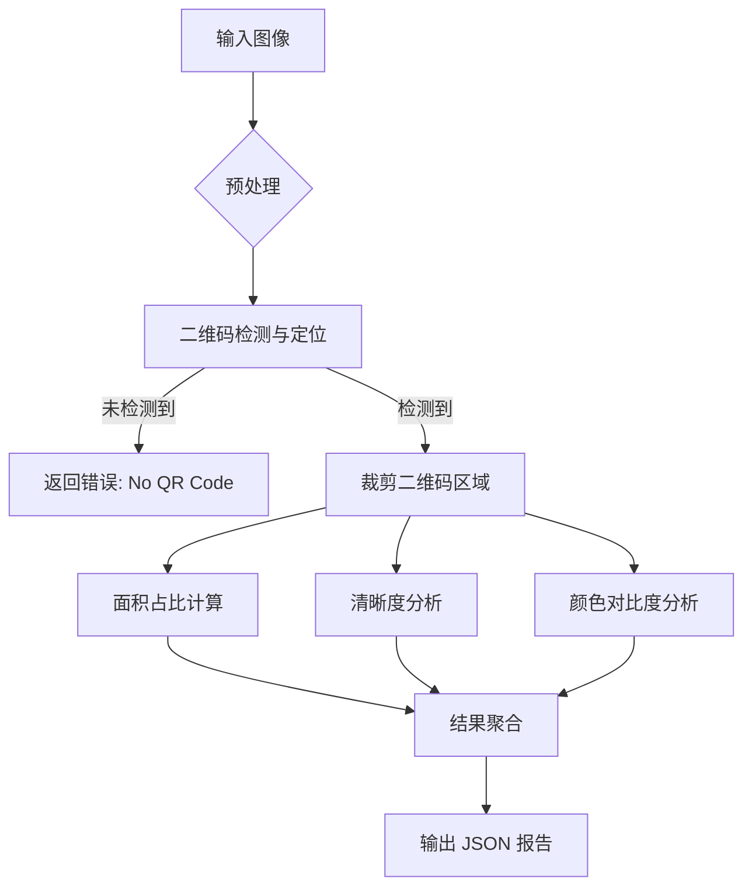

# 02. 系统架构设计 (System Architecture Overview)

## 1. 整体流程图

## 2. 模块详解

### 2.1 预处理模块 (Preprocessing)
- **灰度化**：用于检测和清晰度分析。
- **降噪**：高斯模糊（轻微）以去除随机噪声，避免干扰边缘检测。

### 2.2 检测模块 (Detection)
- 负责找到二维码的四个顶点或边界框 (Bounding Box)。
- 关键技术选型：OpenCV QRCodeDetector, Pyzbar, 或 Deep Learning (YOLO/WeChatQRCode)。

### 2.3 分析模块 (Analysis Engines)
- **面积分析引擎**：利用检测到的包围盒坐标计算面积，对比原图分辨率。
- **清晰度引擎**：计算裁剪区域的拉普拉斯方差 (Variance of Laplacian) 或梯度幅值。
- **颜色引擎**：提取前景与背景的主色调，计算色差 (Delta E)。

## 3. 技术栈建议
- **语言**：Python 3.9+
- **核心库**：
  - `opencv-python`: 图像处理与视觉算法。
  - `numpy`: 数值计算。
  - `pyzbar` (可选): 传统二维码检测。
  - `scikit-image` (可选): 高级色彩空间转换与分析。
